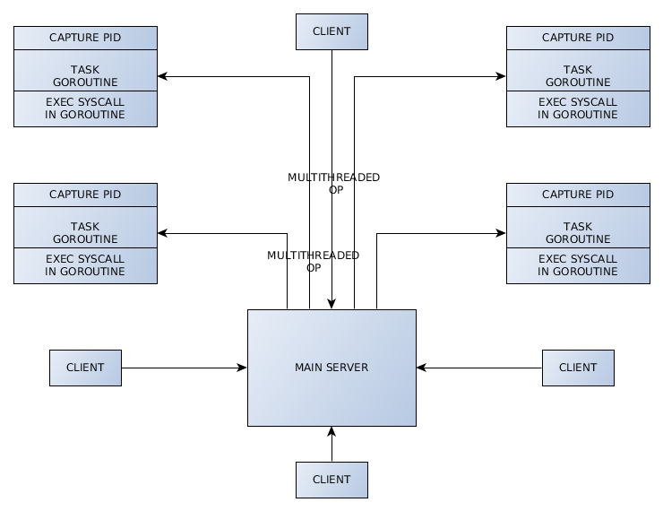
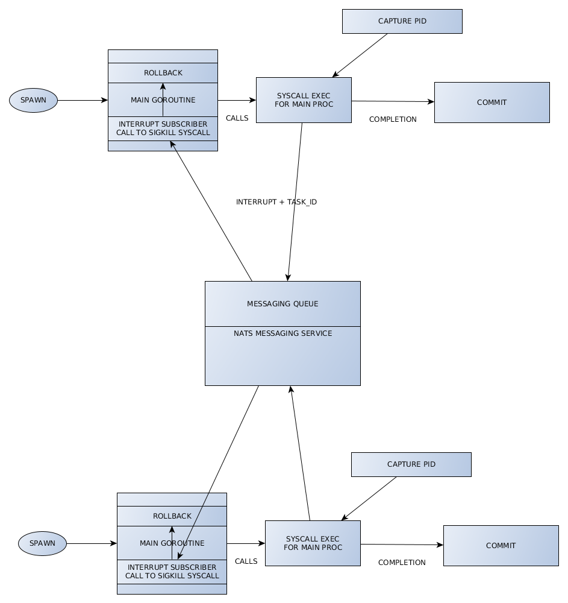

## SocialCops task
An efficient task runner and manipulator for SocialCops

<br/>

[](https://angadsharma1016.github.io/sc-task/)


[](https://www.youtube.com/watch?v=Ldza4HUNZqg&feature=youtu.be)

<br/>
<br/>

<details open>

<summary>Technology stack</summary>

<br/>

- [X] Golang + MySQL
- [X] goroutines and channels for concurrency
- [X] NATS as a high availability messaging queue service
- [X] docker + docker-compose
- [X] apidoc documentation

### Why NATS?
---
[NATS](https://github.com/nats-io/go-nats.git) is an event sourcing tool which we will be using to publish logs and distribute related data between different services. The reason for NATS is:

* RabbitMQ is limited to HTTP and HTTPS natively

* NATS supports gRPC and works fast due to being type safe as well as removing extra overhead of marshalling and unmarshalling

* Publishing events on a different thread and subscribing from a different thread allows non-blocking log sourcing.

* NATS is very high throughput when it comes to requests per second

<br />


<br />
</details>

<br/>

#### Spawn process

<br/>



<br/>
<br/>

#### Process lifecycle

<br/>




<br/>

#### How to run
After running the commands below, wait for DB to build, then goto localhost:3000

```
$ docker-compose build
$ docker-compose up -d
```